# Riego CC2

<p align="center">
  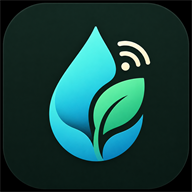
</p>

Controlador de riego solar para cuatro zonas, basado en ESP32, MQTT y válvulas
Rain Bird latching de 9 V. El sistema despierta, consulta órdenes retenidas,
ejecuta rutinas de riego zona a zona y vuelve a deep sleep para ahorrar batería.

El proyecto combina:

- Firmware Arduino/PlatformIO para ESP32.
- PWA instalable para programar y supervisar el riego desde móvil u ordenador.
- Hardware con batería 1S2P, panel solar, MT3608, condensador de apoyo y dos
  puentes H DRV8833.

## Estado actual

- Rutinas programadas por día, hora y duración por zona.
- Botón **Regar ahora** mediante rutina inmediata retenida en MQTT.
- Deep sleep con próximo despertar publicado en HiveMQ.
- Telemetría de batería y estado del controlador.
- Gestión de incidencias Wi-Fi/MQTT: el firmware conserva el progreso de la
  rutina y reintenta sin perder el estado.
- Pausa de 15 s entre cierre de una zona y apertura de la siguiente para
  recargar el condensador.
- Firmware de diagnóstico independiente para probar pulsos de válvulas.

## Fotos del montaje

Registro visual del montaje físico, desde las primeras soldaduras hasta la caja
final instalada.

### Soldaduras

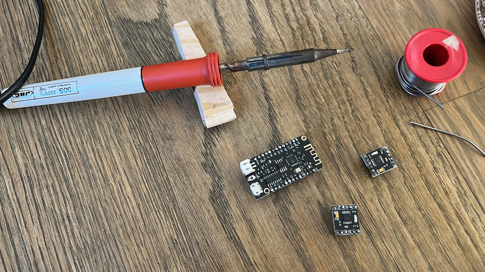

### Conexiones

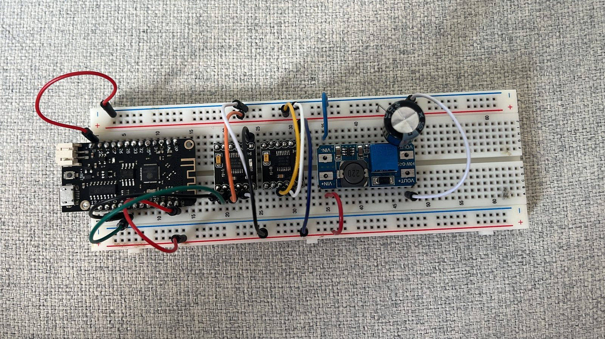

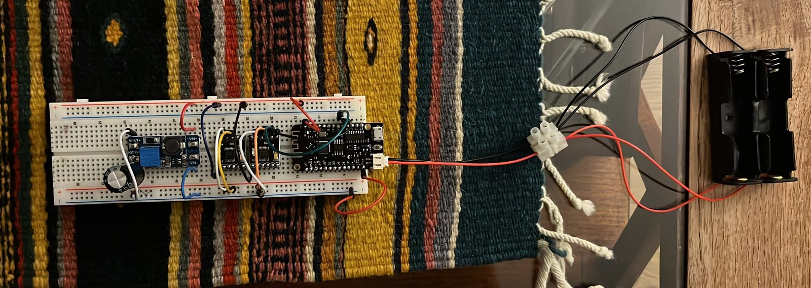

### Proyecto final

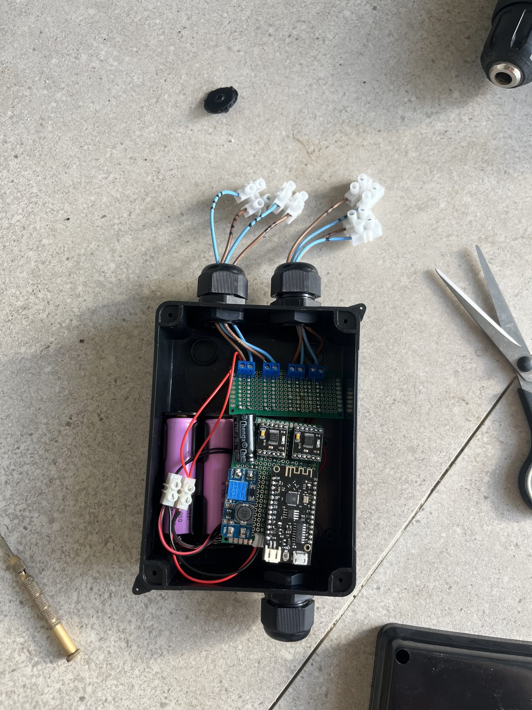

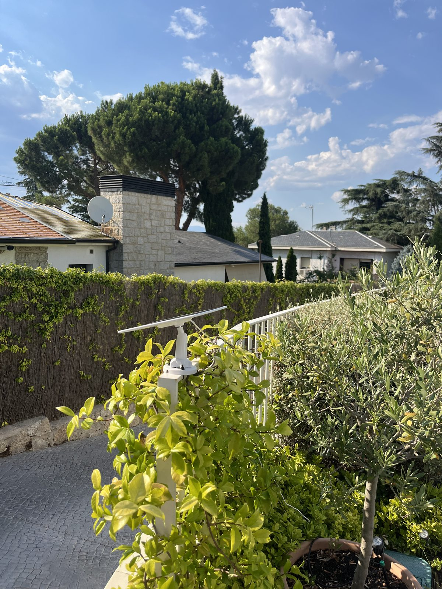

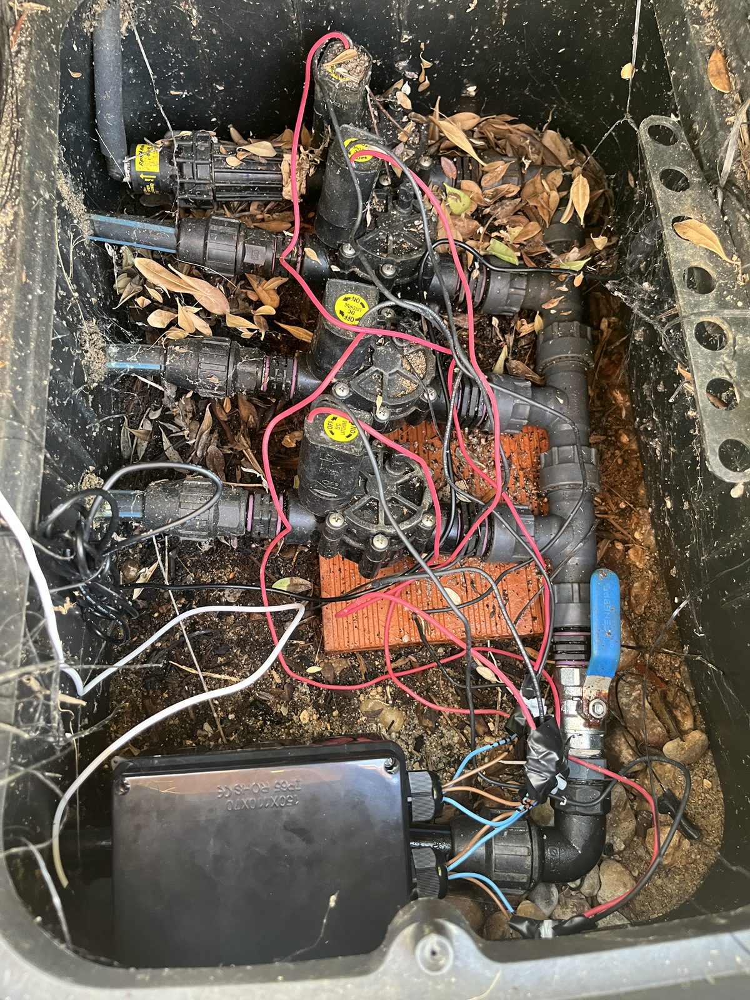

## Arquitectura

```text
Panel solar 5-6 V
      |
      v
Lolin32 Lite ESP32 <---- MQTT / HiveMQ ----> PWA Control-CC2
      |
      +-- Batería 1S2P 18650
      |
      +-- GPIO de control 3.3 V
              |
Batería -> MT3608 9 V -> Condensador 4700 uF -> DRV8833 -> Válvulas latching
```

Cada válvula se acciona con un pulso corto de 50 ms. Al ser latching, mantiene
su estado mecánico sin consumo continuo. El firmware deja todos los pines de
control en `LOW` tras cada pulso.

## Estructura del repositorio

| Carpeta | Contenido |
| --- | --- |
| [`firmware`](firmware/README.md) | Firmware PlatformIO para ESP32 y entorno de prueba `valve_test`. |
| [`frontend`](frontend/README.md) | PWA Control-CC2, conexión MQTT WebSocket, programación y telemetría. |
| [`hardware`](hardware/README.md) | Componentes, arquitectura eléctrica, pruebas y notas de montaje. |
| [`hardware/esquemas`](hardware/esquemas/conexiones.md) | Mapa pin a pin definitivo para soldar y verificar continuidad. |

## Pinout definitivo

| Zona | Apertura | Cierre | Driver |
| --- | --- | --- | --- |
| 1 | GPIO 16 | GPIO 4 | DRV8833 1 |
| 2 | GPIO 18 | GPIO 17 | DRV8833 1 |
| 3 | GPIO 27 | GPIO 26 | DRV8833 2 |
| 4 | GPIO 33 | GPIO 32 | DRV8833 2 |

La batería se mide en `GPIO34` mediante divisor externo 100 kOhm / 100 kOhm.

## Topics MQTT principales

| Función | Topic |
| --- | --- |
| Programación retenida | `riego/programacion/cmd` |
| Rutina inmediata | `riego/routine/config` |
| Estado de rutina | `riego/routine/state` |
| Estado dispositivo | `riego/device/status` |
| Próximo despertar | `riego/device/sleep` |
| Batería | `riego/device/battery` |
| Incidencias | `riego/device/problem` |
| Comandos manuales | `riego/zona1/cmd` ... `riego/zona4/cmd` |
| Estado de zonas | `riego/zona1/state` ... `riego/zona4/state` |

## Firmware

Desde `firmware`:

```powershell
pio run -e esp32dev
pio run -e esp32dev --target upload
pio device monitor -e esp32dev --baud 115200
```

Firmware de prueba de válvulas:

```powershell
pio run -e valve_test --target upload
pio device monitor -e valve_test --baud 115200
```

## Frontend

Desde la raíz del repositorio:

```powershell
powershell -ExecutionPolicy Bypass -File .\frontend\serve.ps1
```

Después abre:

```text
http://localhost:8080
```

Para usarlo desde móvil, despliega la carpeta `frontend` en un hosting HTTPS
como Netlify y abre la URL desde Safari/Chrome. La app se puede instalar como
PWA.

### Capturas del frontend

#### Inicio

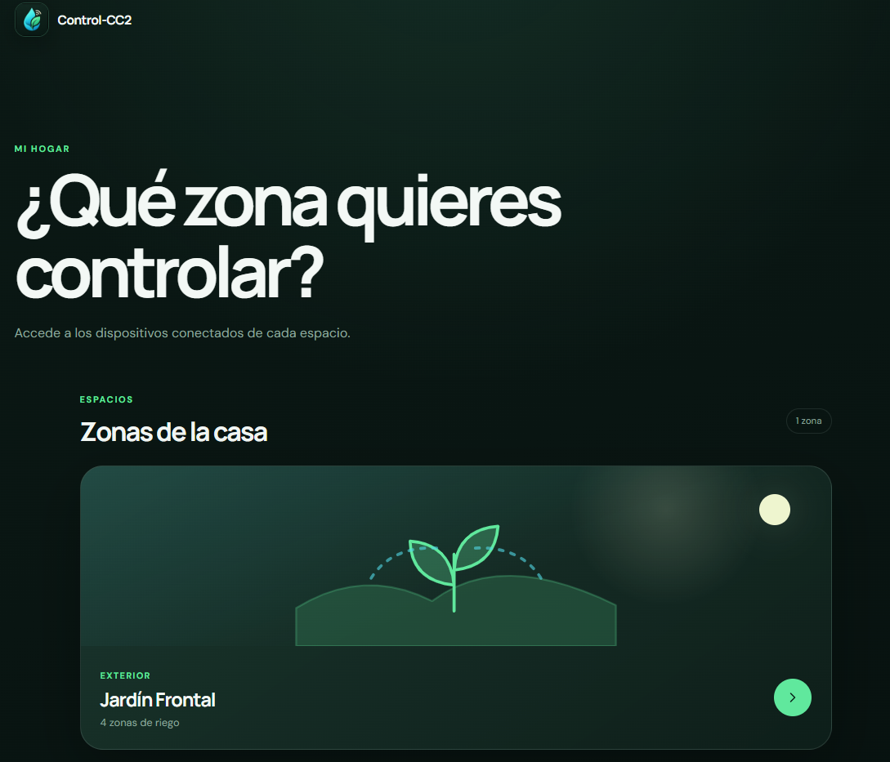

#### Panel Jardín Frontal

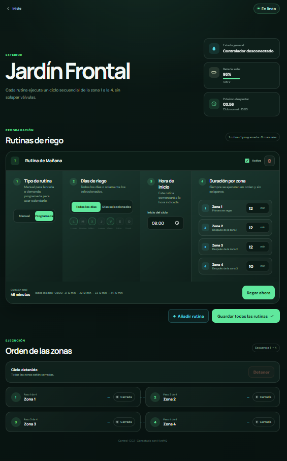

#### Rutina manual

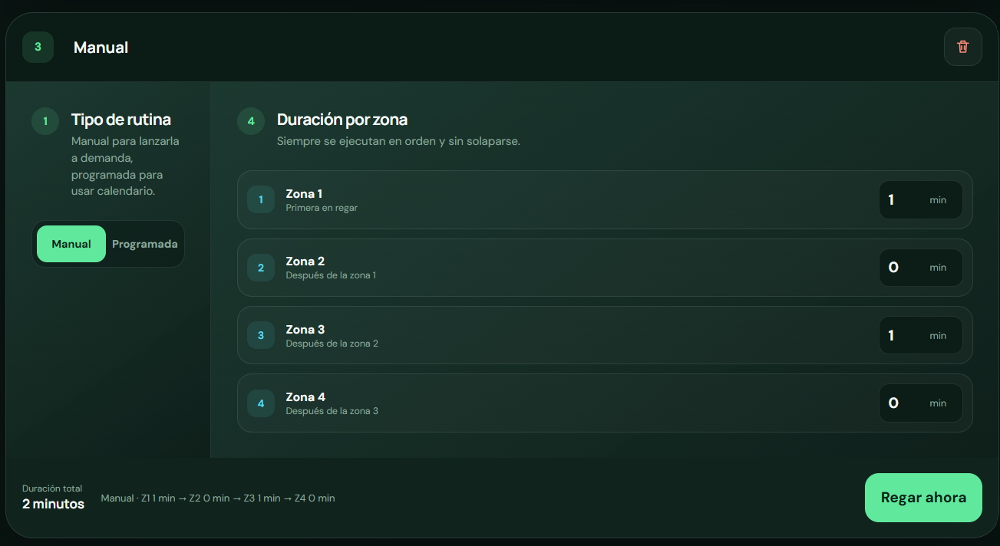

#### Rutina programada

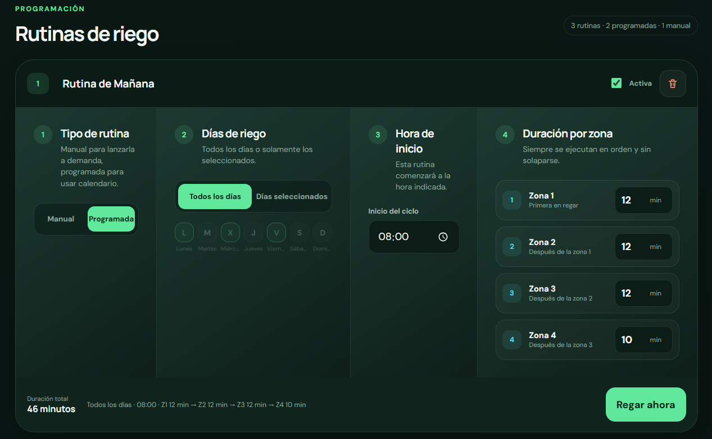

#### Telemetría

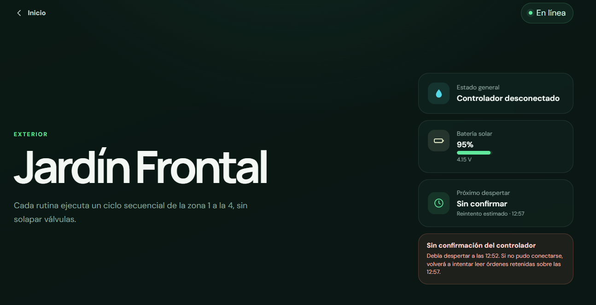

## Seguridad y operación

- No unir salidas de válvulas entre sí: cada electroválvula usa su pareja de
  `OUT`.
- Sí unir todas las masas electrónicas: batería, Lolin32, MT3608 y ambos
  DRV8833.
- Ajustar el MT3608 a 9.0 V con multímetro antes de conectar válvulas.
- No dejar válvulas alimentadas de forma continua; solo pulsos breves.
- Usar un usuario MQTT específico para la web con permisos limitados.

## Documentación detallada

- [Firmware](firmware/README.md)
- [Frontend](frontend/README.md)
- [Hardware](hardware/README.md)
- [Conexiones pin a pin](hardware/esquemas/conexiones.md)
