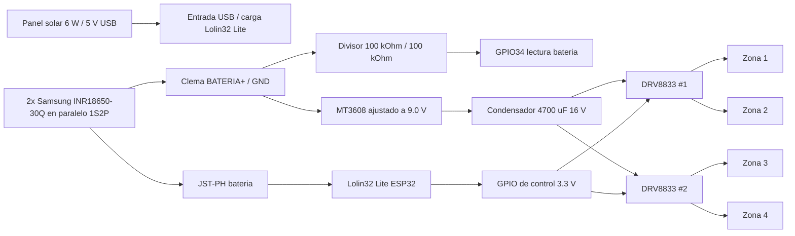

# Hardware del sistema de riego CC2

Esta carpeta documenta el montaje fisico del controlador remoto de riego CC2:
energia solar, acumulacion en baterias 18650, elevacion a 9 V y control de
cuatro electrovalvulas Rain Bird latching mediante puentes H DRV8833.

El objetivo del proyecto es automatizar un jardin de 4 zonas con un sistema IoT
autonomo energeticamente. El ESP32 despierta, se conecta por Wi-Fi, recibe
ordenes MQTT, acciona las valvulas con pulsos cortos y vuelve a deep sleep para
reducir el consumo.

## Arquitectura general



Regla base del sistema: abrir o cerrar una valvula se hace con un pulso corto de
polaridad. Un pulso de +9 V abre y un pulso de -9 V cierra. La valvula mantiene
su posicion mecanicamente, sin consumo en reposo. El puente H invierte la
polaridad y el condensador entrega el pico de corriente necesario para el
latigazo inicial del solenoide.

## Componentes adquiridos y validados

| Subsistema | Modelo | Cantidad | Funcion |
| --- | --- | ---: | --- |
| Logica y control | AZDelivery Lolin32 Lite V1.0, ESP32 | 1 | Controlador principal con Wi-Fi, MQTT, deep sleep y gestor de carga Li-Po/Li-Ion integrado. |
| Captacion solar | Panel solar 6 W, salida 5 V USB | 1 | Alimenta la entrada USB/Micro-USB de la Lolin32 Lite para recargar el sistema con sol. |
| Almacenamiento | Samsung INR18650-30Q, 3.7 V nominales, 3000 mAh | 2 | Pack 1S2P en paralelo, 6000 mAh nominales totales. |
| Soporte bateria | Portapilas 18650 con modulo TC4056 | 2 | Sujeta cada celda y aporta modulo de carga/proteccion integrado, aunque la carga principal del sistema se hace desde la Lolin32 Lite. |
| Elevacion de tension | MT3608 step-up | 1 | Eleva la tension de bateria, 3.7-4.2 V, hasta 9.0 V para las valvulas. |
| Reserva rapida | Condensador electrolitico 4700 uF / 16 V | 1 | Se carga desde el MT3608 y entrega el pico de corriente de hasta 1 A sin colapsar el sistema. |
| Control de valvulas | DRV8833 1.5 A, puente H doble | 2 | Cada modulo controla dos valvulas e invierte la polaridad de salida. |
| Valvulas | Rain Bird latching 9 V DC | 4 | Electrovalvulas de riego por pulso: +9 V para abrir y -9 V para cerrar. |
| Conectores | Micro JST-PH 2.0, 2 pines | Varios | Conexion enchufable para bateria, valvulas y mantenimiento. |
| Divisor bateria | Resistencias 100 kOhm | 2 | Divisor 1:2 para medir la bateria 1S2P desde GPIO34 sin superar 3.3 V. |

Enlaces de compra anotados:

- Lolin32 Lite ESP32: <https://amzn.eu/d/0eqUpAGt>
- Panel solar 6 W: <https://amzn.eu/d/0g4CCCDj>
- Adaptador USB-C a Micro-USB para panel solar/Lolin32: <https://amzn.eu/d/0eiZsTrV>
- Baterias Samsung INR18650-30Q: compradas en Conectrol, calle Jorge Juan, Madrid.
- Portapilas 18650 con modulo TC4056: <https://amzn.eu/d/0fPXKAEj>
- MT3608 step-up: <https://amzn.eu/d/0ffFEiiH>
- DRV8833 puente H: <https://amzn.eu/d/0eqUpAGt>
- Conectores JST-PH 2.0: <https://amzn.eu/d/0cWl7G9F>
- Condensadores 4700 uF / 16 V: <https://amzn.eu/d/0gPaBkLA>

## Conexiones principales

### Energia

| Origen | Destino | Nota |
| --- | --- | --- |
| Panel solar 6 W / 5 V | Adaptador USB-C a Micro-USB y entrada USB de la Lolin32 Lite | Usar la entrada de carga de la placa, no el pin BAT. |
| Bateria 1S2P positivo | JST bateria positivo de la Lolin32 Lite | Cable rojo. Confirmar polaridad antes de enchufar. |
| Bateria 1S2P negativo | JST bateria negativo de la Lolin32 Lite | Cable negro. |
| Clema BATERIA+ | IN+ MT3608 | Alimentacion del elevador desde la bateria, en paralelo con la Lolin32. |
| Clema BATERIA-/GND | IN- MT3608 | Masa comun del sistema. |
| Bateria 1S2P positivo | Resistencia 100 kOhm -> GPIO34 | Rama superior del divisor de medida de bateria. |
| GPIO34 | Resistencia 100 kOhm -> GND comun | Punto medio del divisor; el firmware multiplica la lectura por 2. |
| OUT+ MT3608 | VM / VCC motor de DRV8833 | Ajustar antes el MT3608 a 9.0 V con multimetro. |
| OUT- MT3608 | GND de DRV8833 | Masa comun. |
| OUT+ y OUT- MT3608 | Condensador 4700 uF / 16 V | Pata larga al positivo; franja negativa a GND. |
| 3V3 Lolin32 Lite | EEP / SLEEP de cada DRV8833 | Necesario para despertar el driver; no alimentarlo con 9 V. |

Todos los GND deben estar unidos: Lolin32 Lite, MT3608, DRV8833 y bateria. Sin
masa comun, las senales GPIO no tienen una referencia fiable.

### Control de valvulas con DRV8833

Cada DRV8833 tiene dos canales. Cada canal se usa para una valvula latching.

| Zona | Modulo | Canal DRV8833 | Salida a valvula | Apertura | Cierre |
| --- | --- | --- | --- | --- | --- |
| Zona 1 | DRV8833 #1 | A | AOUT1 / AOUT2 | GPIO 16 | GPIO 4 |
| Zona 2 | DRV8833 #1 | B | BOUT1 / BOUT2 | GPIO 18 | GPIO 17 |
| Zona 3 | DRV8833 #2 | A | AOUT1 / AOUT2 | GPIO 27 | GPIO 26 |
| Zona 4 | DRV8833 #2 | B | BOUT1 / BOUT2 | GPIO 33 | GPIO 32 |

Logica de pulso esperada para cada canal:

| Accion | IN1 / apertura | IN2 / cierre | Tiempo |
| --- | --- | --- | --- |
| Reposo | LOW | LOW | Permanente |
| Abrir | HIGH | LOW | 50 ms aprox. |
| Cerrar | LOW | HIGH | 50 ms aprox. |

Despues de cada pulso, ambos pines deben volver a `LOW`. Las valvulas latching
no deben quedar alimentadas continuamente.

La polaridad anterior se verifico con las valvulas reales: los GPIO que
inicialmente se habian marcado como apertura cerraban fisicamente las valvulas.
Por eso el firmware y esta tabla usan el sentido corregido. Entre el cierre de
una zona y la apertura de la siguiente el firmware espera 15 segundos para dar
tiempo a que el condensador de 4700 uF vuelva a cargarse.

## Esquema de cableado por bloques

```text
                 +----------------------+
                 | Panel solar 6 W / 5 V|
                 +----------+-----------+
                            |
                            v
                  USB / Micro-USB Lolin32
                            |
      +---------------------+---------------------+
      |                                           |
      v                                           v
+-------------+                            +--------------+
| Lolin32 Lite|<--- JST-PH 2.0 --->        | 2x 18650 1S2P|
| ESP32       |                            | 30Q paralelo |
+------+------+                            +------+-------+
       ^                                          |
       | GPIO34                                   | BATERIA+ / GND
       |                                          v
       |                                  +---------------+
       |                                  | Clema bateria |
       |                                  +---+-------+---+
       |                                      |       |
       |                                      |       v
       |                                      |  +-------------+       +9 V        +----------------------+
       |                                      |  | MT3608      +------------------->| DRV8833 #1          |
       |                                      |  | boost 9.0 V |                    | Zona 1 / Zona 2     |
       |                                      |  +------+------+                    +----------------------+
       |                                      |         |
       |                                      |         | +9 V
       |                                      |         v
       |                                      |  +-------------+                    +----------------------+
       |                                      |  | 4700 uF 16 V|------------------->| DRV8833 #2          |
       |                                      |  | en salida   |                    | Zona 3 / Zona 4     |
       |                                      |  +-------------+                    +----------------------+
       |                                      |
       |                                      v
       |                              +---------------+
       +------------------------------| Divisor 100k  |
                                      | / 100k        |
                                      +---------------+

GND comun: Lolin32 Lite, MT3608, condensador y ambos DRV8833.
3V3 comun: EEP/SLEEP de ambos DRV8833, solo logica.
```

## Pruebas realizadas

### Alimentacion y energia

- Panel solar: se conecto el panel a un movil con la app Ampere. La medicion
  mostro una carga neta de +250 mA mientras el telefono consumia unos -560 mA,
  por lo que el panel estaba entregando aproximadamente 810 mA, unos 4.05 W
  reales. Esta prueba confirma margen suficiente para la carga del sistema.
- Baterias Samsung 30Q: ambas celdas llegaron a 3.460 V, tension correcta de
  almacenamiento y practicamente identica entre ellas. Antes de unirlas en
  paralelo se cargaron individualmente en cargador externo hasta unos 4.20 V.

### Soldadura y continuidad

Se soldaron tiras de pines en la Lolin32 Lite y en los modulos DRV8833. Las
primeras soldaduras quedaron frias por el uso de punta y estano gruesos: el
estano formaba bola alrededor del pin sin fusionarse bien con el pad.

La solucion aplicada fue la "Tecnica del Volcan": calentar simultaneamente el
pin y el anillo dorado durante 2-3 segundos hasta que el estano fluyera
correctamente. Despues se verifico continuidad con multimetro y se descartaron
cortocircuitos entre pines contiguos.

### Protoboard y logica DRV8833

En las primeras pruebas, el DRV8833 no entregaba tension en OUT1/OUT2. Revisando
el esquema del modulo se diagnostico que el pin EEP/SLEEP no tenia pull-up
interno suficiente y habia que conectarlo directamente a 3.3 V para despertar el
chip.

La prueba de fuerza bruta consistio en inyectar manualmente 3.3 V y 0 V en IN1 e
IN2. Se midieron 3.3 V estables en la salida, confirmando que las soldaduras de
VCC, GND, EEP y los canales principales eran funcionales.

### Potencia, MT3608 y prueba final

- El MT3608 se alimento desde la linea de bateria de la Lolin32 Lite y se ajusto
  con multimetro hasta 9.0 V. El potenciometro es multivuelta: fueron necesarias
  unas 15 vueltas en sentido antihorario para subir desde unos 3.2 V hasta 9.0 V.
  Durante la calibracion se hicieron lecturas precisas para evitar disparar la
  proteccion de sobrecorriente del USB del PC.
- El condensador de 4700 uF se conecto en paralelo a la linea de 9 V, respetando
  polaridad: pata larga a positivo y franja al negativo.
- El VCC de potencia del DRV8833 se alimento con 9 V, mientras que EEP/SLEEP se
  mantuvo a 3.3 V. Este punto es critico: EEP/SLEEP no debe recibir la linea de
  9 V.
- Con un firmware de prueba PlatformIO (`env:valve_test`) se probaron las cuatro
  zonas con pulsos de 50 ms y pausas largas. La prueba confirmo que el sentido
  fisico correcto es: GPIO 16/18/27/33 para abrir y GPIO 4/17/26/32 para cerrar.
- Las primeras pruebas con pulsos largos descargaban el condensador y podian
  provocar maniobras debiles. La prueba final usa pulsos reales de 50 ms y 15 s
  entre maniobras para permitir la recarga.

## Montaje recomendado

1. Montar primero la parte de baja tension: Lolin32 Lite, bateria y carga por
   USB, sin conectar todavia el MT3608 ni las valvulas.
2. Preparar las dos 18650 en paralelo: rojo con rojo y negro con negro. Deben
   ser celdas iguales, con estado similar y tension muy parecida antes de unir.
3. Soldar o crimpar el JST-PH 2.0 para la bateria y verificar polaridad con
   multimetro antes de conectarlo a la Lolin32 Lite.
4. Conectar el MT3608 al pin BAT/GND y ajustar su salida a 9.0 V antes de
   conectar los DRV8833.
5. Soldar el condensador de 4700 uF en la salida de 9 V, lo mas cerca posible de
   los DRV8833.
6. Conectar EEP/SLEEP de cada DRV8833 a 3.3 V y unir todas las masas.
7. Cablear un DRV8833 y probar una sola valvula con pulsos manuales cortos.
8. Repetir para las cuatro zonas y etiquetar cada conector JST de valvula.
9. Solo cuando la prueba de banco sea estable, montar en caja estanca y llevar
   el panel solar al exterior.

## Notas de seguridad

- No poner las dos 18650 en serie. Este proyecto usa un pack paralelo 1S2P.
- No unir celdas en paralelo si tienen tensiones distintas. Igualarlas antes
  evita corrientes bruscas entre baterias.
- Anadir proteccion o fusible al pack de bateria si el portapilas no la trae.
  Las celdas 18650 pueden entregar mucha corriente en caso de cortocircuito.
- Usar la entrada de carga de la Lolin32 Lite para la bateria 1S. No cargar las
  celdas conectandolas directamente a un panel solar.
- Ajustar el MT3608 siempre con multimetro. Una salida por encima de 9 V puede
  danar valvulas o drivers.
- El condensador de 4700 uF tiene polaridad. Si se conecta al reves puede
  calentarse o fallar.
- EEP/SLEEP del DRV8833 es una entrada logica: mantenerla a 3.3 V, nunca a 9 V.
- No dejar las valvulas energizadas. El firmware debe usar pulsos breves y
  volver a reposo.

## Pendientes de cierre

- Medir consumo real en reposo, Wi-Fi activo y deep sleep.
- Probar una temporada completa en exterior para confirmar margen energetico con
  dias nublados.
- Medir la tension real del condensador antes y despues de cada pulso para
  decidir si conviene aumentar capacidad o colocar uno por modulo DRV8833.
- Guardar fotos del montaje final en `hardware/datasheets` o en una nueva
  carpeta `hardware/esquemas`.
