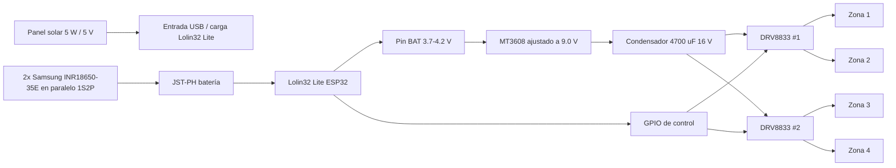

# Hardware del sistema de riego CC2

Esta carpeta documenta el montaje físico del controlador de riego: energía
solar, batería, elevación a 9 V y control de las cuatro electroválvulas
latching Rain Bird mediante módulos puente H.

El firmware actual todavía usa el GPIO 2 como prueba de una sola zona. Este
README describe el hardware objetivo para pasar de la prueba con LED/relé al
control real de 4 zonas.

## Arquitectura general



Regla base del sistema: abrir o cerrar una válvula se hace con un pulso corto
de polaridad. Un pulso +9 V abre y un pulso -9 V cierra. El puente H invierte
la polaridad electrónicamente y el condensador entrega el pico de corriente.

## Lista de componentes comprados

| Subsistema | Modelo | Cantidad | Función |
| --- | --- | ---: | --- |
| Lógica y control | AZDelivery Lolin32 Lite V1.0, ESP-32 Rev1 | 1 | Controlador principal con Wi-Fi, MQTT, temporización de pulsos y carga de batería Li-ion integrada. |
| Captación solar | Panel solar 5 W, salida 5 V | 1 | Alimenta la entrada USB/Micro-USB de la Lolin32 Lite para recargar el sistema con sol. |
| Almacenamiento | Samsung INR 18650 35E, 3450 mAh | 2 | Pack de batería 1S2P de unos 6900 mAh nominales. |
| Soporte batería | Portapilas 18650 del pack GTIWUNG | 2 | Sujeta cada celda y permite cablearlas en paralelo. |
| Elevación de tensión | AZDelivery MT3608 boost converter | 1 | Convierte la tensión de batería, 3.7-4.2 V, a 9.0 V para las válvulas. |
| Reserva rápida | Condensador electrolítico 4700 uF 16 V | 1 mínimo | Acumula energía en la línea de 9 V para el pulso de apertura/cierre. |
| Control de válvulas | DRV8833 1.5 A, puente H doble | 3 | Dos módulos controlan 4 zonas; queda un módulo de repuesto. |
| Conectores | YIXISI Micro JST-PH 2.0, 2 pines | Varios | Conexión enchufable para batería, válvulas y mantenimiento. |

Enlaces de compra anotados:

- Panel solar 5 W: <https://www.amazon.es/dp/B0DRG93291/>
- Baterías Samsung INR 18650 35E: <https://bateriasonline.com/es/baterias-litio-recargable/bateria-litio-samsung-inr-18650-35e-3450mah-samsung-baterias-litio-recargable.html>
- Portapilas GTIWUNG: enlace original de Amazon pendiente de limpiar.
- MT3608 AZDelivery: enlace original de Amazon pendiente de limpiar.

## Conexiones principales

### Energía

| Origen | Destino | Nota |
| --- | --- | --- |
| Panel solar 5 V | USB/Micro-USB de la Lolin32 Lite | Usar la entrada de carga de la placa, no el pin BAT. |
| Batería 1S2P positivo | JST batería positivo de la Lolin32 Lite | Cable rojo. Confirmar polaridad del conector antes de enchufar. |
| Batería 1S2P negativo | JST batería negativo de la Lolin32 Lite | Cable negro. |
| Pin BAT Lolin32 Lite | IN+ MT3608 | Alimentación del elevador desde la batería gestionada por la placa. |
| GND Lolin32 Lite | IN- MT3608 | Masa común del sistema. |
| OUT+ MT3608 | VM / alimentación motor de DRV8833 | Ajustar antes el MT3608 a 9.0 V con multímetro. |
| OUT- MT3608 | GND de DRV8833 | Masa común. |
| OUT+ y OUT- MT3608 | Condensador 4700 uF 16 V | Respetar polaridad: pata larga/positivo a +9 V, negativo a GND. |

Todos los GND deben estar unidos: Lolin32 Lite, MT3608, DRV8833 y batería. Sin
masa común, las señales GPIO no tendrán una referencia fiable.

### Control de válvulas con DRV8833

Cada DRV8833 tiene dos canales. Cada canal se usa para una válvula latching.

| Zona | Módulo | Canal DRV8833 | Salida a válvula | Señales ESP32 propuestas |
| --- | --- | --- | --- | --- |
| Zona 1 | DRV8833 #1 | A | AOUT1 / AOUT2 | Z1_IN1 / Z1_IN2 |
| Zona 2 | DRV8833 #1 | B | BOUT1 / BOUT2 | Z2_IN1 / Z2_IN2 |
| Zona 3 | DRV8833 #2 | A | AOUT1 / AOUT2 | Z3_IN1 / Z3_IN2 |
| Zona 4 | DRV8833 #2 | B | BOUT1 / BOUT2 | Z4_IN1 / Z4_IN2 |

La asignación exacta de GPIO se cerrará en el firmware. Como criterio, usar
pines GPIO de salida normales y evitar pines de arranque delicados si el módulo
los deja expuestos. Mantener GPIO 2 solo para pruebas mientras el firmware siga
en el estado inicial.

Lógica de pulso esperada para cada canal:

| Acción | IN1 | IN2 | Tiempo |
| --- | --- | --- | --- |
| Reposo | LOW | LOW | Permanente |
| Abrir | HIGH | LOW | 50 ms aprox. |
| Cerrar | LOW | HIGH | 50 ms aprox. |

Después de cada pulso, ambos pines deben volver a `LOW`. Las válvulas latching
no deben quedar alimentadas continuamente.

## Esquema de cableado por bloques

```text
                 +----------------------+
                 | Panel solar 5 W / 5 V|
                 +----------+-----------+
                            |
                            v
                  USB / Micro-USB Lolin32
                            |
      +---------------------+---------------------+
      |                                           |
      v                                           v
+-------------+                            +--------------+
| Lolin32 Lite|<--- JST-PH 2.0 --->        | 2x 18650 1S2P|
| ESP32       |                            | paralelo     |
+------+------+                            +--------------+
       |
       | BAT 3.7-4.2 V
       v
+-------------+       +9 V        +----------------------+
| MT3608      +------------------->| DRV8833 #1          |
| boost 9.0 V |                    | Zona 1 / Zona 2     |
+------+------+                    +----------------------+
       |
       | +9 V
       v
+-------------+                    +----------------------+
| 4700 uF 16 V|------------------->| DRV8833 #2          |
| en salida   |                    | Zona 3 / Zona 4     |
+-------------+                    +----------------------+

GND comun: Lolin32 Lite, MT3608, condensador y ambos DRV8833.
```

## Montaje recomendado

1. Montar primero la parte de baja tensión: Lolin32 Lite, batería y carga por
   USB, sin conectar todavía el MT3608 ni las válvulas.
2. Preparar las dos 18650 en paralelo: rojo con rojo y negro con negro. Deben
   ser celdas iguales, con estado similar y tensión muy parecida antes de unir.
3. Soldar o crimpar el JST-PH 2.0 para la batería y verificar polaridad con
   multímetro antes de conectarlo a la Lolin32 Lite.
4. Conectar el MT3608 al pin BAT/GND y ajustar su salida a 9.0 V antes de
   conectar los DRV8833.
5. Soldar el condensador de 4700 uF en la salida de 9 V, lo más cerca posible
   de los DRV8833.
6. Cablear un DRV8833 y probar una sola válvula con pulsos manuales cortos.
7. Repetir para las cuatro zonas y etiquetar cada conector JST de válvula.
8. Solo cuando la prueba de banco sea estable, montar en caja estanca y llevar
   el panel solar al exterior.

## Notas de seguridad

- No poner las dos 18650 en serie. Este proyecto usa un pack paralelo 1S2P.
- No unir celdas en paralelo si tienen tensiones distintas. Igualarlas antes
  evita corrientes bruscas entre baterías.
- Añadir protección/fusible al pack de batería si el portapilas no la trae. Las
  celdas 18650 pueden entregar mucha corriente en caso de cortocircuito.
- Los módulos TC4056 del pack GTIWUNG no se usan aquí, porque la Lolin32 Lite
  ya incorpora circuito de carga para una celda Li-ion 1S.
- Confirmar que el cargador de la Lolin32 Lite admite la corriente disponible
  del panel solar. Si el panel da problemas por sol variable, añadir un módulo
  de carga solar específico para Li-ion.
- Ajustar el MT3608 siempre con multímetro. Una salida por encima de 9 V puede
  dañar válvulas o drivers.
- El condensador de 4700 uF tiene polaridad. Si se conecta al revés puede
  calentarse o fallar.
- No dejar las válvulas energizadas. El firmware debe usar pulsos breves y
  volver a reposo.

## Pendientes de cierre

- Elegir los GPIO definitivos de las ocho señales de control.
- Actualizar el firmware para 4 zonas y pulsos de inversión con DRV8833.
- Medir consumo real en reposo, Wi-Fi activo y deep sleep.
- Probar si un condensador de 4700 uF basta para todas las válvulas o conviene
  colocar uno por módulo DRV8833.
- Guardar fotos del montaje final en `hardware/esquemas` o `hardware/datasheets`
  junto con datasheets reales de cada módulo.
